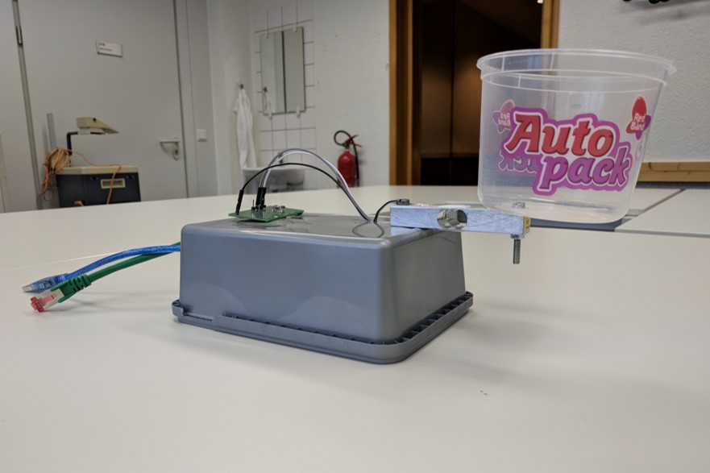

# Adaptive Classroom Manager
This is my first real Github / MAIOU Project, it'll be used to coordinate my (*also*) first ever "*Maîtrise d'ouvrage*" project.

**Adaptive Classroom Manager**, or ACM, is the original name of my first ever "Maîtrise d'ouvrage" project.
The principal idea is an IOT device that can detect the state of the classroom and report that state to some authority; for the MAIOU project, its mostly a Proof of Concept, so there are ideas and features that will not be implemented, but theoretically could be in the future.

I'll be using an Arduino for the project, mainly an Uno because of the dynamic memory (RAM) limitations on the Nano, even though I'll try, the main limitation are the external libraries e.g. for the ENC28J60 chip

I might try working with different branches, but the main one will surely be for the Arduino Uno.

## Features

##### Main:
- Send Discord messages
- Use the HX711 / Load Cell
  - it prints the measurements to the Serial port
- Detect when a chalk / pen box is "empty"
- Detect if lights are on

##### Planned/WIP:
- Fixing stuff up

###### Possible:  
- Detect if windows are opend (heat)
- Detect if people are in the classroom (sound)

## What's Maîtrise d'ouvrage (MAIOU)? and what are you going to do?

It's a school subject. We do projects and stuff...

My first ever project is **this**, and explained in documents sent to the specific teachers are the features that this project requires.
The first idea was a box that contains chalk or pens and would send an email if it's empty.  
This has been changed to using Discord to send a message, as it is way simpler to just make an HTTP request than to send an email. (in this case to my server, because the Arduino isn't powerful enough for SSL required by the Discord API)

In the end I sent everything over MQTT and it was handled on NodeRED in a cleaner way.

The MQTT topic was as such: `site + "/classroom/" + classroom + "/" + reason"`. (site being the location)  
Example: "SL/classroom/242/light"

This makes it easy to know expand, as we can still add other reasons, or even other tools that aren't even in classrooms.

## Is it working? 

Yes, somewhat.
Most of the work is done on NodeRED, which isn't included in this repository.

### Releases
There might be releases?  
I don't really know what i'm gonna release though, probaby just version it, if needed.

## Additional Info
This is currently "based" on the [Ethernet library's DHCP-based IP printer sketch](https://github.com/arduino-libraries/Ethernet/blob/master/examples/DhcpAddressPrinter/DhcpAddressPrinter.ino), [@maditnerd implementation of sending Discord messages](https://github.com/maditnerd/discord_test/blob/master/discord_test_mkr1010/discord.h), [Michael Schoeffler's OLED + HX711 code](http://www.mschoeffler.de/2017/12/04/arduino-tutorial-hx711-load-cell-amplifier-weight-sensor-module-lcm1602-iic-v1-lcd/), aswell as [Aranacorp's code for the photoresistor measurements](https://www.aranacorp.com/en/luminosity-measurement-with-a-photoresistor/).
 
To switch to MQTT instead of using a reverse proxy and doing everything on the Arduino, I used [a MQTT Library with pretty good examples.](https://github.com/arduino-libraries/ArduinoMqttClient).
 
Knowing pretty much nothing in electronics, Arduino/Microcontroller related things, the libraries i used, or even C++ (We only cover Java at school), i looked up a lot of things online, and adapted the examples to fit my goal.
The included Examples in the "Arduino IDE" (File -> Examples) and the Arduino Referce were quite helpful at understanding how an Arduino works or more C++ specific things.

### NGINX config
Check the [config file](tools/nginx.conf).
